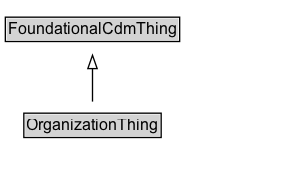

# OrganizationThing

A class representing an organization in the context of the CDM ontology.

## Diagram

=== "SVG (interactive)"

    <!-- Generated by graphviz version 14.1.3 (20260303.0454)
     -->
    <!-- Pages: 1 -->
    <svg width="213pt" height="132pt"
     viewBox="0.00 0.00 213.00 132.00" xmlns="http://www.w3.org/2000/svg" xmlns:xlink="http://www.w3.org/1999/xlink">
    <g id="graph0" class="graph" transform="scale(1 1) rotate(0) translate(4 128)">
    <polygon fill="white" stroke="none" points="-4,4 -4,-128 209.38,-128 209.38,4 -4,4"/>
    <g id="clust3" class="cluster">
    <title>cluster_associated</title>
    </g>
    <!-- FoundationalCdmThing -->
    <g id="node1" class="node">
    <title>FoundationalCdmThing</title>
    <g id="a_node1"><a xlink:href="../FoundationalCdmThing" xlink:title="&lt;TABLE&gt;">
    <polygon fill="lightgray" stroke="none" points="1,-97.88 1,-114.12 129.75,-114.12 129.75,-97.88 1,-97.88"/>
    <text xml:space="preserve" text-anchor="start" x="2" y="-101.88" font-family="Arial" font-size="12.00">FoundationalCdmThing</text>
    <polygon fill="none" stroke="black" points="0,-96.88 0,-115.12 130.75,-115.12 130.75,-96.88 0,-96.88"/>
    </a>
    </g>
    </g>
    <!-- OrganizationThing -->
    <g id="node2" class="node">
    <title>OrganizationThing</title>
    <g id="a_node2"><a xlink:href="../OrganizationThing" xlink:title="&lt;TABLE&gt;">
    <polygon fill="lightgray" stroke="none" points="14.88,-25.88 14.88,-42.12 115.88,-42.12 115.88,-25.88 14.88,-25.88"/>
    <text xml:space="preserve" text-anchor="start" x="15.88" y="-29.88" font-family="Arial" font-size="12.00">OrganizationThing</text>
    <polygon fill="none" stroke="black" points="13.88,-24.88 13.88,-43.12 116.88,-43.12 116.88,-24.88 13.88,-24.88"/>
    </a>
    </g>
    </g>
    <!-- OrganizationThing&#45;&gt;FoundationalCdmThing -->
    <g id="edge1" class="edge">
    <title>OrganizationThing&#45;&gt;FoundationalCdmThing</title>
    <path fill="none" stroke="black" d="M65.38,-51.79C65.38,-59.25 65.38,-68.24 65.38,-76.69"/>
    <polygon fill="none" stroke="black" points="61.88,-76.54 65.38,-86.54 68.88,-76.54 61.88,-76.54"/>
    </g>
    <!-- Invis -->
    </g>
    </svg>

=== "PNG"

    

## Specializations of OrganizationThing

| Class | Description |
|-------|-------------|
| [Organization](Organization.md) | A collection of people organized together into a community or other social, commercial or political structure. The group has some common purpose or reason for existence which goes beyond the set of people belonging to it. An organization may itself be able to act as an agent.
        In addition to the standard org:Organization pattern, this ontology defines an cdm1:Organization to be a subclass of an cdm1:Agent. |

## Formalization for OrganizationThing

| Property | Constraint |
|----------|------------|
| subClassOf | [FoundationalCdmThing](FoundationalCdmThing.md) |

