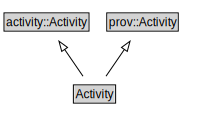

# Activity

<a href="../../diagrams/Prov__Activity.dot.svg">Open interactive Activity diagram</a>

## Formalization for Activity

| Property | Constraint |
|----------|------------|
| subClassOf | activity::Activity |
| subClassOf | prov::Activity |

