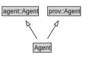

# Agent

<a href="../../diagrams/Prov__Agent.dot.svg">Open interactive Agent diagram</a>

## Formalization for Agent

| Property | Constraint |
|----------|------------|
| subClassOf | agent::Agent |
| subClassOf | prov::Agent |

