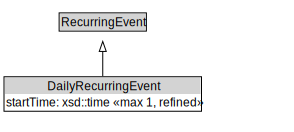

# DailyRecurringEvent

<a href="../../diagrams/RecurringEvent__DailyRecurringEvent.dot.svg">Open interactive DailyRecurringEvent diagram</a>

## Formalization for DailyRecurringEvent

| Property | Constraint |
|----------|------------|
| startTime | max 1 owl::Thing |
| subClassOf | RecurringEvent |

