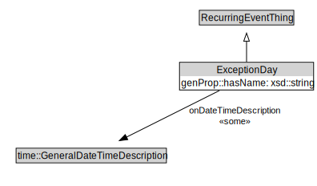

# ExceptionDay

<a href="../../diagrams/RecurringEvent__ExceptionDay.dot.svg">Open interactive ExceptionDay diagram</a>

## Formalization for ExceptionDay

| Property | Constraint |
|----------|------------|
| genProp::hasName | some xsd::string |
| onDateTimeDescription | some time::GeneralDateTimeDescription |
| subClassOf | RecurringEventThing |

