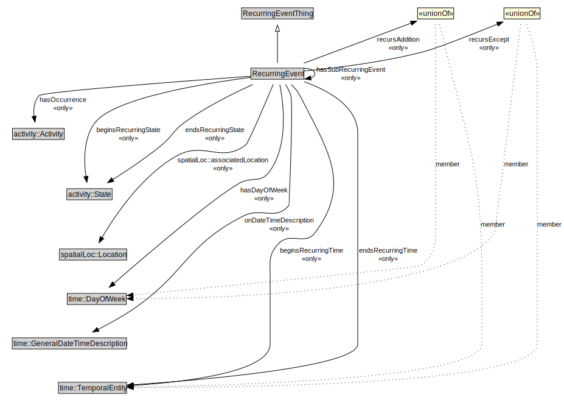

# RecurringEvent

<a href="../../diagrams/RecurringEvent__RecurringEvent.dot.svg">Open interactive RecurringEvent diagram</a>

## Specializations of RecurringEvent

| Class | Description |
|-------|-------------|
| [Daily Recurring Event (RecurringEvent)](RecurringEvent__DailyRecurringEvent.md) |  |
| [Monthly Recurring Event (RecurringEvent)](RecurringEvent__MonthlyRecurringEvent.md) |  |
| [Weekly Recurring Event (RecurringEvent)](RecurringEvent__WeeklyRecurringEvent.md) |  |
| [Yearly Recurring Event (RecurringEvent)](RecurringEvent__YearlyRecurringEvent.md) |  |

## Formalization for RecurringEvent

| Property | Constraint |
|----------|------------|
| beginsRecurringState | all activity::State |
| beginsRecurringTime | all time::TemporalEntity |
| endsRecurringState | all activity::State |
| endsRecurringTime | all time::TemporalEntity |
| endTime | all xsd::time |
| hasDayOfWeek | all time::DayOfWeek |
| hasOccurrence | all activity::Activity |
| hasSubRecurringEvent | all RecurringEvent |
| onDateTimeDescription | all time::GeneralDateTimeDescription |
| recursAddition | all time::DayOfWeek or time::TemporalEntity |
| recursExcept | all time::DayOfWeek or time::TemporalEntity |
| spatialLoc::associatedLocation | all spatialLoc::Location |
| startTime | all xsd::time |
| subClassOf | RecurringEventThing |

## Used by classes

| Class | Property |
|-------|----------|
| [Recurring Event (RecurringEvent)](RecurringEvent__RecurringEvent.md) | hasSubRecurringEvent |

