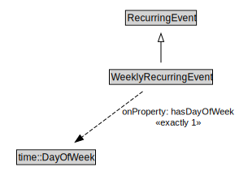

# WeeklyRecurringEvent

<a href="../../diagrams/RecurringEvent__WeeklyRecurringEvent.dot.svg">Open interactive WeeklyRecurringEvent diagram</a>

## Formalization for WeeklyRecurringEvent

| Property | Constraint |
|----------|------------|
| hasDayOfWeek | exactly 1 owl::Thing |
| subClassOf | RecurringEvent |

