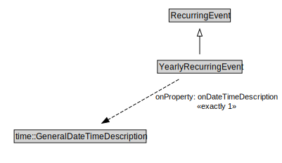

# YearlyRecurringEvent

<a href="../../diagrams/RecurringEvent__YearlyRecurringEvent.dot.svg">Open interactive YearlyRecurringEvent diagram</a>

## Formalization for YearlyRecurringEvent

| Property | Constraint |
|----------|------------|
| onDateTimeDescription | exactly 1 owl::Thing |
| subClassOf | RecurringEvent |

