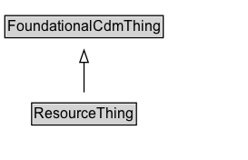

# ResourceThing

Added for organizational purposes, to identify all classes defined in the Resource ontology.

## Diagram

=== "SVG (interactive)"

    <!-- Generated by graphviz version 14.1.3 (20260303.0454)
     -->
    <!-- Pages: 1 -->
    <svg width="204pt" height="132pt"
     viewBox="0.00 0.00 204.00 132.00" xmlns="http://www.w3.org/2000/svg" xmlns:xlink="http://www.w3.org/1999/xlink">
    <g id="graph0" class="graph" transform="scale(1 1) rotate(0) translate(4 128)">
    <polygon fill="white" stroke="none" points="-4,4 -4,-128 200.38,-128 200.38,4 -4,4"/>
    <g id="clust3" class="cluster">
    <title>cluster_associated</title>
    </g>
    <!-- FoundationalCdmThing -->
    <g id="node1" class="node">
    <title>FoundationalCdmThing</title>
    <g id="a_node1"><a xlink:href="../FoundationalCdmThing" xlink:title="&lt;TABLE&gt;">
    <polygon fill="lightgray" stroke="none" points="1,-97.88 1,-114.12 129.75,-114.12 129.75,-97.88 1,-97.88"/>
    <text xml:space="preserve" text-anchor="start" x="2" y="-101.88" font-family="Arial" font-size="12.00">FoundationalCdmThing</text>
    <polygon fill="none" stroke="black" points="0,-96.88 0,-115.12 130.75,-115.12 130.75,-96.88 0,-96.88"/>
    </a>
    </g>
    </g>
    <!-- ResourceThing -->
    <g id="node2" class="node">
    <title>ResourceThing</title>
    <g id="a_node2"><a xlink:href="../ResourceThing" xlink:title="&lt;TABLE&gt;">
    <polygon fill="lightgray" stroke="none" points="23.12,-25.88 23.12,-42.12 107.62,-42.12 107.62,-25.88 23.12,-25.88"/>
    <text xml:space="preserve" text-anchor="start" x="24.12" y="-29.88" font-family="Arial" font-size="12.00">ResourceThing</text>
    <polygon fill="none" stroke="black" points="22.12,-24.88 22.12,-43.12 108.62,-43.12 108.62,-24.88 22.12,-24.88"/>
    </a>
    </g>
    </g>
    <!-- ResourceThing&#45;&gt;FoundationalCdmThing -->
    <g id="edge1" class="edge">
    <title>ResourceThing&#45;&gt;FoundationalCdmThing</title>
    <path fill="none" stroke="black" d="M65.38,-51.79C65.38,-59.25 65.38,-68.24 65.38,-76.69"/>
    <polygon fill="none" stroke="black" points="61.88,-76.54 65.38,-86.54 68.88,-76.54 61.88,-76.54"/>
    </g>
    <!-- Invis -->
    </g>
    </svg>

=== "PNG"

    

## Specializations of ResourceThing

| Class | Description |
|-------|-------------|
| [Consume State](ConsumeState.md) | Identifies a Resource and Quantity it consumes. The Quantity is removed from the Resource. |
| [Divisible Resource](DivisibleResource.md) | A Resource that can be divided for use or consumption between multiple Activities. |
| [Non Divisible Resource](NonDivisibleResource.md) | A Resource that can only be used for a single Activity at once - even if it isn't fully utilized. |
| [Planned Allocation](PlannedAllocation.md) | Specifies the planned allocation of a resource to an activity via a state.
        Note that Allocation is a Manifestation as the allocation may change over time. |
| [Produce State](ProduceState.md) | Identifies a Resource and Quantity it produces. |
| [Release State](ReleaseState.md) | Identifies a Resource and Quantity it releases (after using). |
| [Resource](Resource.md) | A Resource is a generic representation of some Thing that can be "used" in an Activity. 
        A Resource may have some Location, amount or availability, according to the definition of the Manifestation or TimeVaryingEntity. 
        A Resource must be classified as some Resource Type.
        A Resource may participate in some Activity Occurrence. In other words, it links to the Activity that the Resource is being used/consumed/produced/released at the time of the manifestation.
        A specific Resource may be used in or consumed in some activity occurrence. |
| [Terminal Resource State](TerminalResourceState.md) |  |
| [Use State](UseState.md) | Identifies a Resource and Quantity it uses (without consuming). |

## Formalization for ResourceThing

| Property | Constraint |
|----------|------------|
| subClassOf | [FoundationalCdmThing](FoundationalCdmThing.md) |

