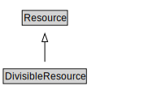

# DivisibleResource

<a href="../../diagrams/Resource__DivisibleResource.dot.svg">Open interactive DivisibleResource diagram</a>

## Formalization for DivisibleResource

| Property | Constraint |
|----------|------------|
| disjointWith | NonDivisibleResource |
| subClassOf | Resource |

