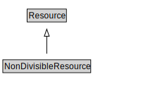

# NonDivisibleResource

<a href="../../diagrams/Resource__NonDivisibleResource.dot.svg">Open interactive NonDivisibleResource diagram</a>

## Formalization for NonDivisibleResource

| Property | Constraint |
|----------|------------|
| subClassOf | Resource |

