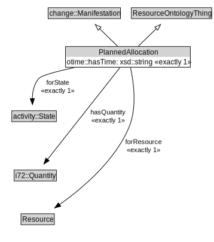

# PlannedAllocation

<a href="../../diagrams/Resource__PlannedAllocation.dot.svg">Open interactive PlannedAllocation diagram</a>

## Formalization for PlannedAllocation

| Property | Constraint |
|----------|------------|
| forResource | exactly 1 owl::Thing |
| forState | exactly 1 owl::Thing |
| hasQuantity | exactly 1 owl::Thing |
| otime::hasTime | exactly 1 owl::Thing |
| subClassOf | change::Manifestation |
| subClassOf | ResourceOntologyThing |

## Used by classes

| Class | Property |
|-------|----------|
| [Resource (Resource)](Resource__Resource.md) | hasAllocation |
| [Terminal Resource State (Resource)](Resource__TerminalResourceState.md) | hasAllocation |

