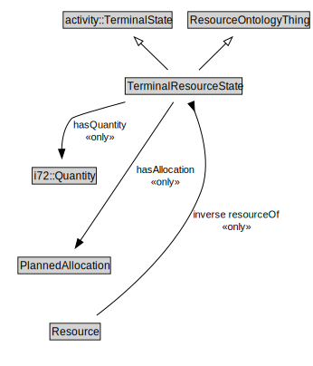

# TerminalResourceState

<a href="../../diagrams/Resource__TerminalResourceState.dot.svg">Open interactive TerminalResourceState diagram</a>

## Specializations of TerminalResourceState

| Class | Description |
|-------|-------------|
| [Consume State (Resource)](Resource__ConsumeState.md) |  |
| [Produce State (Resource)](Resource__ProduceState.md) |  |
| [Release State (Resource)](Resource__ReleaseState.md) |  |
| [Use State (Resource)](Resource__UseState.md) |  |

## Formalization for TerminalResourceState

| Property | Constraint |
|----------|------------|
| hasAllocation | all PlannedAllocation |
| hasQuantity | all i72::Quantity |
| inverse resourceOf | all Resource |
| subClassOf | activity::TerminalState |
| subClassOf | ResourceOntologyThing |

