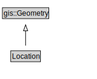

# Location

<a href="../../diagrams/SpatialLoc__Location.dot.svg">Open interactive Location diagram</a>

## Formalization for Location

| Property | Constraint |
|----------|------------|
| subClassOf | gis::Geometry |

