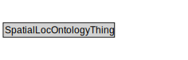

# SpatialLocOntologyThing

<a href="../../diagrams/SpatialLoc__SpatialLocOntologyThing.dot.svg">Open interactive SpatialLocOntologyThing diagram</a>

## Specializations of SpatialLocOntologyThing

| Class | Description |
|-------|-------------|
| [Location (SpatialLoc)](SpatialLoc__Location.md) |  |

