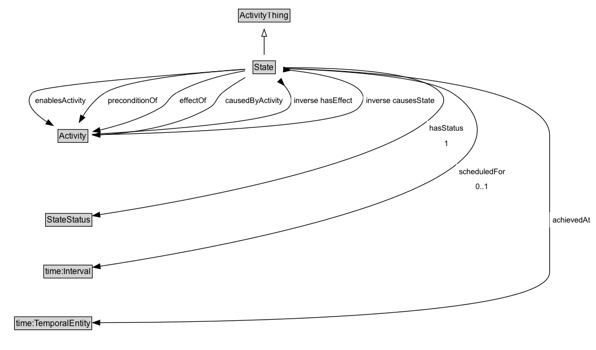

# State

A State describes some situation in the world which may or may not be satisfied (true) at a given point in time. A State refers to a class of manifestations. It may be a precondition or effect of some Activity, or more generally it may be enabled or be caused by some Activity. If a state is complex, it may refer to some combination of classes of manifestations.
        Example: A shopping activity, Activity-Shop, can require both the VehicleW30LGas state, but also some state wherein the mall is open, OpenMall. Each state is defined separately. The combined state is then defined as the conjunction of the two states. Thus, we could say that the preconditions for Activity-Shop are: precondition(VehicleW30LGas,Activity-Shop) AND  precondition(OpenMall,Activity-Shop). Alternatively, if the preconditions were required disjunctively, we could state: precondition(VehicleW30LGas,Activity-Shop) OR precondition(OpenMall,Activity-Shop).
        In large and complex domains, there can be cases in which the above approach is undesirable. In particular, due to the complexity of the description that results as the state being described becomes more detailed. In many cases it will be more natural and convenient to be able to refer to a single, aggregate state. We therefore extend the representation of States to capture aggregation, as approached in the concept of state trees introduced by TOVE as a construct for the activity cluster.
        A State may be either non-terminal or terminal. A terminal state has no child states, and therefore refers directly to a class of manifestations, whereas a non-terminal state has child states, which may define some classes of manifestations, or further define some other complex states.
            NonTerminalState(x) v TerminalState(x) = State(x)
        A state  cannot be both non-terminal and terminal.
            TerminalState disjointWith NonTerminalState

## Diagram

=== "SVG (interactive)"

    <!-- Generated by graphviz version 14.1.3 (20260303.0454)
     -->
    <!-- Pages: 1 -->
    <svg width="841pt" height="495pt"
     viewBox="0.00 0.00 841.00 495.00" xmlns="http://www.w3.org/2000/svg" xmlns:xlink="http://www.w3.org/1999/xlink">
    <g id="graph0" class="graph" transform="scale(1 1) rotate(0) translate(4 490.5)">
    <polygon fill="white" stroke="none" points="-4,4 -4,-490.5 837.25,-490.5 837.25,4 -4,4"/>
    <g id="clust3" class="cluster">
    <title>cluster_associated</title>
    </g>
    <!-- ActivityThing -->
    <g id="node1" class="node">
    <title>ActivityThing</title>
    <g id="a_node1"><a xlink:href="../ActivityThing" xlink:title="&lt;TABLE&gt;">
    <polygon fill="lightgray" stroke="none" points="333.5,-460.38 333.5,-476.62 404.5,-476.62 404.5,-460.38 333.5,-460.38"/>
    <text xml:space="preserve" text-anchor="start" x="334.5" y="-464.38" font-family="Arial" font-size="12.00">ActivityThing</text>
    <polygon fill="none" stroke="black" points="332.5,-459.38 332.5,-477.62 405.5,-477.62 405.5,-459.38 332.5,-459.38"/>
    </a>
    </g>
    </g>
    <!-- State -->
    <g id="node2" class="node">
    <title>State</title>
    <g id="a_node2"><a xlink:href="../State" xlink:title="&lt;TABLE&gt;">
    <polygon fill="lightgray" stroke="none" points="354.12,-387.38 354.12,-403.62 383.88,-403.62 383.88,-387.38 354.12,-387.38"/>
    <text xml:space="preserve" text-anchor="start" x="355.12" y="-391.38" font-family="Arial" font-size="12.00">State</text>
    <polygon fill="none" stroke="black" points="353.12,-386.38 353.12,-404.62 384.88,-404.62 384.88,-386.38 353.12,-386.38"/>
    </a>
    </g>
    </g>
    <!-- State&#45;&gt;ActivityThing -->
    <g id="edge1" class="edge">
    <title>State&#45;&gt;ActivityThing</title>
    <path fill="none" stroke="black" d="M369,-413.21C369,-420.97 369,-430.42 369,-439.24"/>
    <polygon fill="none" stroke="black" points="365.5,-439.16 369,-449.16 372.5,-439.16 365.5,-439.16"/>
    </g>
    <!-- Invis -->
    <!-- State&#45;&gt;Invis -->
    <!-- Activity -->
    <g id="node4" class="node">
    <title>Activity</title>
    <g id="a_node4"><a xlink:href="../Activity" xlink:title="&lt;TABLE&gt;">
    <polygon fill="lightgray" stroke="none" points="78.88,-290.38 78.88,-306.62 119.12,-306.62 119.12,-290.38 78.88,-290.38"/>
    <text xml:space="preserve" text-anchor="start" x="79.88" y="-294.38" font-family="Arial" font-size="12.00">Activity</text>
    <polygon fill="none" stroke="black" points="77.88,-289.38 77.88,-307.62 120.12,-307.62 120.12,-289.38 77.88,-289.38"/>
    </a>
    </g>
    </g>
    <!-- State&#45;&gt;Activity -->
    <g id="edge8" class="edge">
    <title>State&#45;&gt;Activity</title>
    <path fill="none" stroke="black" d="M342.07,-392.6C265.56,-387.06 51.78,-370.66 41.75,-359.5 29.05,-345.37 44.66,-329.86 62.77,-318.15"/>
    <polygon fill="black" stroke="black" points="64.27,-321.33 71.03,-313.18 60.66,-315.33 64.27,-321.33"/>
    <polygon fill="white" stroke="none" points="41.75,-338 41.75,-359.5 121,-359.5 121,-338 41.75,-338"/>
    <text xml:space="preserve" text-anchor="start" x="45.75" y="-345" font-family="Arial" font-size="11.00">enablesActivity</text>
    </g>
    <!-- State&#45;&gt;Activity -->
    <g id="edge12" class="edge">
    <title>State&#45;&gt;Activity</title>
    <path fill="none" stroke="black" d="M342.02,-392.83C289.82,-389.18 177.2,-379.23 144.25,-359.5 131.05,-351.59 120.4,-338.23 112.76,-326.12"/>
    <polygon fill="black" stroke="black" points="115.9,-324.56 107.83,-317.7 109.86,-328.1 115.9,-324.56"/>
    <polygon fill="white" stroke="none" points="144.25,-338 144.25,-359.5 222,-359.5 222,-338 144.25,-338"/>
    <text xml:space="preserve" text-anchor="start" x="148.25" y="-345" font-family="Arial" font-size="11.00">preconditionOf</text>
    </g>
    <!-- State&#45;&gt;Activity -->
    <g id="edge14" class="edge">
    <title>State&#45;&gt;Activity</title>
    <path fill="none" stroke="black" d="M342.08,-390.58C316.09,-385.96 276.25,-376.65 245.5,-359.5 233.14,-352.61 234.27,-345.06 222,-338 195.43,-322.71 162.06,-312.76 136.79,-306.81"/>
    <polygon fill="black" stroke="black" points="137.8,-303.45 127.28,-304.68 136.28,-310.28 137.8,-303.45"/>
    <polygon fill="white" stroke="none" points="245.5,-338 245.5,-359.5 291,-359.5 291,-338 245.5,-338"/>
    <text xml:space="preserve" text-anchor="start" x="249.5" y="-345" font-family="Arial" font-size="11.00">effectOf</text>
    </g>
    <!-- State&#45;&gt;Activity -->
    <g id="edge15" class="edge">
    <title>State&#45;&gt;Activity</title>
    <path fill="none" stroke="black" d="M342.28,-380.99C331.74,-375.07 319.82,-367.62 310,-359.5 300.17,-351.37 302.05,-344.36 291,-338 242.73,-310.21 177.61,-302.22 136.98,-300.07"/>
    <polygon fill="black" stroke="black" points="137.35,-296.58 127.21,-299.65 137.05,-303.58 137.35,-296.58"/>
    <polygon fill="white" stroke="none" points="310,-338 310,-359.5 399,-359.5 399,-338 310,-338"/>
    <text xml:space="preserve" text-anchor="start" x="314" y="-345" font-family="Arial" font-size="11.00">causedByActivity</text>
    </g>
    <!-- StateStatus -->
    <g id="node5" class="node">
    <title>StateStatus</title>
    <g id="a_node5"><a xlink:href="../StateStatus" xlink:title="&lt;TABLE&gt;">
    <polygon fill="lightgray" stroke="none" points="61.25,-171.88 61.25,-188.12 124.75,-188.12 124.75,-171.88 61.25,-171.88"/>
    <text xml:space="preserve" text-anchor="start" x="62.25" y="-175.88" font-family="Arial" font-size="12.00">StateStatus</text>
    <polygon fill="none" stroke="black" points="60.25,-170.88 60.25,-189.12 125.75,-189.12 125.75,-170.88 60.25,-170.88"/>
    </a>
    </g>
    </g>
    <!-- State&#45;&gt;StateStatus -->
    <g id="edge10" class="edge">
    <title>State&#45;&gt;StateStatus</title>
    <path fill="none" stroke="black" d="M395.86,-394.94C454.17,-395.26 589.43,-392.36 618,-359.5 624.27,-352.29 623.71,-345.66 618,-338 559.15,-258.98 251.82,-205.05 136.65,-187.34"/>
    <polygon fill="black" stroke="black" points="137.39,-183.91 126.98,-185.87 136.34,-190.83 137.39,-183.91"/>
    <polygon fill="white" stroke="none" points="598.64,-277 598.64,-320 654.64,-320 654.64,-277 598.64,-277"/>
    <text xml:space="preserve" text-anchor="start" x="602.64" y="-305.5" font-family="Arial" font-size="11.00">hasStatus</text>
    <text xml:space="preserve" text-anchor="start" x="623.64" y="-284" font-family="Arial" font-size="11.00">1</text>
    </g>
    <!-- time_Interval -->
    <g id="node6" class="node">
    <title>time_Interval</title>
    <g id="a_node6"><a xlink:href="https://w3id.org/citydata/imported/time/latest/Interval" xlink:title="&lt;TABLE&gt;">
    <polygon fill="lightgray" stroke="none" points="58.75,-98.88 58.75,-115.12 125.25,-115.12 125.25,-98.88 58.75,-98.88"/>
    <text xml:space="preserve" text-anchor="start" x="59.75" y="-102.88" font-family="Arial" font-size="12.00">time:Interval</text>
    <polygon fill="none" stroke="black" points="57.75,-97.88 57.75,-116.12 126.25,-116.12 126.25,-97.88 57.75,-97.88"/>
    </a>
    </g>
    </g>
    <!-- State&#45;&gt;time_Interval -->
    <g id="edge9" class="edge">
    <title>State&#45;&gt;time_Interval</title>
    <path fill="none" stroke="black" d="M395.88,-393.8C455.15,-391.8 594.9,-384.5 634,-359.5 666.28,-338.86 681.9,-307.72 659,-277 595.07,-191.24 259.85,-133.16 137.09,-114.49"/>
    <polygon fill="black" stroke="black" points="137.8,-111.05 127.39,-113.03 136.76,-117.98 137.8,-111.05"/>
    <polygon fill="white" stroke="none" points="640.05,-216 640.05,-259 713.3,-259 713.3,-216 640.05,-216"/>
    <text xml:space="preserve" text-anchor="start" x="644.05" y="-244.5" font-family="Arial" font-size="11.00">scheduledFor</text>
    <text xml:space="preserve" text-anchor="start" x="667.67" y="-223" font-family="Arial" font-size="11.00">0..1</text>
    </g>
    <!-- time_TemporalEntity -->
    <g id="node7" class="node">
    <title>time_TemporalEntity</title>
    <g id="a_node7"><a xlink:href="https://w3id.org/citydata/imported/time/latest/TemporalEntity" xlink:title="&lt;TABLE&gt;">
    <polygon fill="lightgray" stroke="none" points="17.5,-25.88 17.5,-42.12 124.5,-42.12 124.5,-25.88 17.5,-25.88"/>
    <text xml:space="preserve" text-anchor="start" x="18.5" y="-29.88" font-family="Arial" font-size="12.00">time:TemporalEntity</text>
    <polygon fill="none" stroke="black" points="16.5,-24.88 16.5,-43.12 125.5,-43.12 125.5,-24.88 16.5,-24.88"/>
    </a>
    </g>
    </g>
    <!-- State&#45;&gt;time_TemporalEntity -->
    <g id="edge7" class="edge">
    <title>State&#45;&gt;time_TemporalEntity</title>
    <path fill="none" stroke="black" d="M395.75,-393.94C485.76,-391.36 772,-377.04 772,-299.5 772,-299.5 772,-299.5 772,-106 772,-42.52 311.07,-35.3 136.73,-34.85"/>
    <polygon fill="black" stroke="black" points="136.94,-31.35 126.94,-34.83 136.93,-38.35 136.94,-31.35"/>
    <polygon fill="white" stroke="none" points="772,-169.25 772,-190.75 833.25,-190.75 833.25,-169.25 772,-169.25"/>
    <text xml:space="preserve" text-anchor="start" x="776" y="-176.25" font-family="Arial" font-size="11.00">achievedAt</text>
    </g>
    <!-- Invis&#45;&gt;Activity -->
    <!-- Activity&#45;&gt;State -->
    <g id="edge11" class="edge">
    <title>Activity&#45;&gt;State</title>
    <path fill="none" stroke="black" d="M125.89,-300.91C196.82,-304.89 384.77,-317.32 403,-338 411.44,-347.58 406.07,-359.54 397.32,-369.99"/>
    <polygon fill="black" stroke="black" points="387.94,-374.85 397.34,-369.97 393.04,-379.65 387.94,-374.85"/>
    <polygon fill="white" stroke="none" points="407.23,-338 407.23,-359.5 497.73,-359.5 497.73,-338 407.23,-338"/>
    <text xml:space="preserve" text-anchor="start" x="411.23" y="-345" font-family="Arial" font-size="11.00">inverse hasEffect</text>
    </g>
    <!-- Activity&#45;&gt;State -->
    <g id="edge13" class="edge">
    <title>Activity&#45;&gt;State</title>
    <path fill="none" stroke="black" d="M125.94,-300.02C212.09,-301.97 476.71,-310.18 502,-338 532.18,-371.21 455.25,-385.59 406.16,-391.25"/>
    <polygon fill="black" stroke="black" points="395.98,-388.82 406.3,-391.23 396.73,-395.78 395.98,-388.82"/>
    <polygon fill="white" stroke="none" points="508.77,-338 508.77,-359.5 613.52,-359.5 613.52,-338 508.77,-338"/>
    <text xml:space="preserve" text-anchor="start" x="512.77" y="-345" font-family="Arial" font-size="11.00">inverse causesState</text>
    </g>
    <!-- Activity&#45;&gt;StateStatus -->
    <!-- StateStatus&#45;&gt;time_Interval -->
    <!-- time_Interval&#45;&gt;time_TemporalEntity -->
    </g>
    </svg>

=== "PNG"

    

## Specializations of State

| Class | Description |
|-------|-------------|
| [Conjunctive State](ConjunctiveState.md) | A type of NonTerminalState that is defined by the conjunction of its child States. |
| [Consume State](ConsumeState.md) | Identifies a Resource and Quantity it consumes. The Quantity is removed from the Resource. |
| [Disjunctive State](DisjunctiveState.md) | A type of NonTerminalState that is defined by the disjunction of its child States. A State cannot be both conjunctive and disjunctive.  |
| [Manifestation State](ManifestationState.md) | A specialization of TerminalState, the ManifestationState specifies a Manifestation class that an individual must satisfy in order for the ManifestationState to be true. |
| [Non Terminal State](NonTerminalState.md) | A NonTerminalState has child States (a.k.a., sub-states) that are either conjuctive or disjunctive. Each child may be a TerminalState or NonTerminalState; eventually a TerminalState is reached. A State cannot be both non-terminal and terminal. |
| [Produce State](ProduceState.md) | Identifies a Resource and Quantity it produces. |
| [Release State](ReleaseState.md) | Identifies a Resource and Quantity it releases (after using). |
| [Terminal Resource State](TerminalResourceState.md) |  |
| [Terminal State](TerminalState.md) | A terminal state type has no substates (cannot be decomposed). It corresponds to a particular class of manifestations. A terminal state is achieved at some time if and only if there exists a manifestation within its defined classification, that exists at that time. |
| [Use State](UseState.md) | Identifies a Resource and Quantity it uses (without consuming). |

## Formalization for State

| Property | Constraint |
|----------|------------|
| [achievedAt](../properties/achievedAt.md) | only [time:TemporalEntity](http://www.w3.org/2006/time#TemporalEntity) |
| [causedByActivity](../properties/causedByActivity.md) | only [Activity](https://w3id.org/citydata/part1/v1/Activity) |
| [effectOf](../properties/effectOf.md) | only [Activity](https://w3id.org/citydata/part1/v1/Activity) |
| [enablesActivity](../properties/enablesActivity.md) | only [Activity](https://w3id.org/citydata/part1/v1/Activity) |
| [hasStatus](../properties/hasStatus.md) | exactly 1 |
| [hasStatus](../properties/hasStatus.md) | exactly 1 [StateStatus](https://w3id.org/citydata/part1/v1/StateStatus) |
| [preconditionOf](../properties/preconditionOf.md) | only [Activity](https://w3id.org/citydata/part1/v1/Activity) |
| [scheduledFor](../properties/scheduledFor.md) | max 1 |
| [scheduledFor](../properties/scheduledFor.md) | max 1 [time:Interval](http://www.w3.org/2006/time#Interval) |
| subClassOf | [ActivityThing](ActivityThing.md) |

