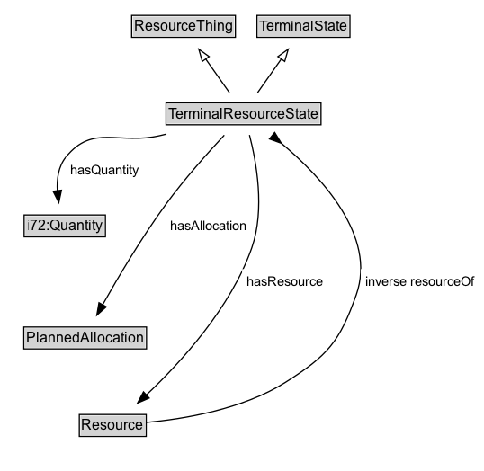

# TerminalResourceState

## Diagram

=== "SVG (interactive)"

    <!-- Generated by graphviz version 14.1.3 (20260303.0454)
     -->
    <!-- Pages: 1 -->
    <svg width="403pt" height="393pt"
     viewBox="0.00 0.00 403.00 393.00" xmlns="http://www.w3.org/2000/svg" xmlns:xlink="http://www.w3.org/1999/xlink">
    <g id="graph0" class="graph" transform="scale(1 1) rotate(0) translate(4 389)">
    <polygon fill="white" stroke="none" points="-4,4 -4,-389 399.48,-389 399.48,4 -4,4"/>
    <g id="clust3" class="cluster">
    <title>cluster_associated</title>
    </g>
    <!-- ResourceThing -->
    <g id="node1" class="node">
    <title>ResourceThing</title>
    <g id="a_node1"><a xlink:href="../ResourceThing" xlink:title="&lt;TABLE&gt;">
    <polygon fill="lightgray" stroke="none" points="106.75,-358.88 106.75,-375.12 191.25,-375.12 191.25,-358.88 106.75,-358.88"/>
    <text xml:space="preserve" text-anchor="start" x="107.75" y="-362.88" font-family="Arial" font-size="12.00">ResourceThing</text>
    <polygon fill="none" stroke="black" points="105.75,-357.88 105.75,-376.12 192.25,-376.12 192.25,-357.88 105.75,-357.88"/>
    </a>
    </g>
    </g>
    <!-- TerminalState -->
    <g id="node2" class="node">
    <title>TerminalState</title>
    <g id="a_node2"><a xlink:href="../TerminalState" xlink:title="&lt;TABLE&gt;">
    <polygon fill="lightgray" stroke="none" points="211.25,-358.88 211.25,-375.12 286.75,-375.12 286.75,-358.88 211.25,-358.88"/>
    <text xml:space="preserve" text-anchor="start" x="212.25" y="-362.88" font-family="Arial" font-size="12.00">TerminalState</text>
    <polygon fill="none" stroke="black" points="210.25,-357.88 210.25,-376.12 287.75,-376.12 287.75,-357.88 210.25,-357.88"/>
    </a>
    </g>
    </g>
    <!-- TerminalResourceState -->
    <g id="node3" class="node">
    <title>TerminalResourceState</title>
    <g id="a_node3"><a xlink:href="../TerminalResourceState" xlink:title="&lt;TABLE&gt;">
    <polygon fill="lightgray" stroke="none" points="135.38,-285.88 135.38,-302.12 262.62,-302.12 262.62,-285.88 135.38,-285.88"/>
    <text xml:space="preserve" text-anchor="start" x="136.38" y="-289.88" font-family="Arial" font-size="12.00">TerminalResourceState</text>
    <polygon fill="none" stroke="black" points="134.38,-284.88 134.38,-303.12 263.62,-303.12 263.62,-284.88 134.38,-284.88"/>
    </a>
    </g>
    </g>
    <!-- TerminalResourceState&#45;&gt;ResourceThing -->
    <g id="edge1" class="edge">
    <title>TerminalResourceState&#45;&gt;ResourceThing</title>
    <path fill="none" stroke="black" d="M187.24,-311.71C181.33,-320.09 174.05,-330.43 167.43,-339.84"/>
    <polygon fill="none" stroke="black" points="164.62,-337.75 161.72,-347.94 170.34,-341.78 164.62,-337.75"/>
    </g>
    <!-- TerminalResourceState&#45;&gt;TerminalState -->
    <g id="edge2" class="edge">
    <title>TerminalResourceState&#45;&gt;TerminalState</title>
    <path fill="none" stroke="black" d="M210.76,-311.71C216.67,-320.09 223.95,-330.43 230.57,-339.84"/>
    <polygon fill="none" stroke="black" points="227.66,-341.78 236.28,-347.94 233.38,-337.75 227.66,-341.78"/>
    </g>
    <!-- Invis -->
    <!-- TerminalResourceState&#45;&gt;Invis -->
    <!-- i72_Quantity -->
    <g id="node5" class="node">
    <title>i72_Quantity</title>
    <g id="a_node5"><a xlink:href="https://w3id.org/citydata/21972/v1/Quantity" xlink:title="&lt;TABLE&gt;">
    <polygon fill="lightgray" stroke="none" points="17.12,-192.38 17.12,-208.62 82.88,-208.62 82.88,-192.38 17.12,-192.38"/>
    <text xml:space="preserve" text-anchor="start" x="18.12" y="-196.38" font-family="Arial" font-size="12.00">i72:Quantity</text>
    <polygon fill="none" stroke="black" points="16.12,-191.38 16.12,-209.62 83.88,-209.62 83.88,-191.38 16.12,-191.38"/>
    </a>
    </g>
    </g>
    <!-- TerminalResourceState&#45;&gt;i72_Quantity -->
    <g id="edge9" class="edge">
    <title>TerminalResourceState&#45;&gt;i72_Quantity</title>
    <path fill="none" stroke="black" d="M134.73,-277.13C133.14,-276.75 131.56,-276.37 130,-276 94.96,-267.69 73.71,-285.95 51,-258 44.64,-250.17 43.23,-239.52 43.81,-229.58"/>
    <polygon fill="black" stroke="black" points="47.25,-230.31 45.05,-219.94 40.31,-229.42 47.25,-230.31"/>
    <polygon fill="white" stroke="none" points="51,-236.5 51,-258 116,-258 116,-236.5 51,-236.5"/>
    <text xml:space="preserve" text-anchor="start" x="55" y="-243.5" font-family="Arial" font-size="11.00">hasQuantity</text>
    </g>
    <!-- PlannedAllocation -->
    <g id="node6" class="node">
    <title>PlannedAllocation</title>
    <g id="a_node6"><a xlink:href="../PlannedAllocation" xlink:title="&lt;TABLE&gt;">
    <polygon fill="lightgray" stroke="none" points="16.88,-98.88 16.88,-115.12 117.12,-115.12 117.12,-98.88 16.88,-98.88"/>
    <text xml:space="preserve" text-anchor="start" x="17.88" y="-102.88" font-family="Arial" font-size="12.00">PlannedAllocation</text>
    <polygon fill="none" stroke="black" points="15.88,-97.88 15.88,-116.12 118.12,-116.12 118.12,-97.88 15.88,-97.88"/>
    </a>
    </g>
    </g>
    <!-- TerminalResourceState&#45;&gt;PlannedAllocation -->
    <g id="edge8" class="edge">
    <title>TerminalResourceState&#45;&gt;PlannedAllocation</title>
    <path fill="none" stroke="black" d="M182.96,-276.23C169.3,-261.56 149.52,-239.39 134.25,-218.5 114.23,-191.11 94.42,-157.56 81.54,-134.67"/>
    <polygon fill="black" stroke="black" points="84.63,-133.02 76.71,-125.98 78.51,-136.42 84.63,-133.02"/>
    <polygon fill="white" stroke="none" points="134.25,-189.75 134.25,-211.25 206,-211.25 206,-189.75 134.25,-189.75"/>
    <text xml:space="preserve" text-anchor="start" x="138.25" y="-196.75" font-family="Arial" font-size="11.00">hasAllocation</text>
    </g>
    <!-- Resource -->
    <g id="node7" class="node">
    <title>Resource</title>
    <g id="a_node7"><a xlink:href="../Resource" xlink:title="&lt;TABLE&gt;">
    <polygon fill="lightgray" stroke="none" points="63.12,-25.88 63.12,-42.12 116.88,-42.12 116.88,-25.88 63.12,-25.88"/>
    <text xml:space="preserve" text-anchor="start" x="64.12" y="-29.88" font-family="Arial" font-size="12.00">Resource</text>
    <polygon fill="none" stroke="black" points="62.12,-24.88 62.12,-43.12 117.88,-43.12 117.88,-24.88 62.12,-24.88"/>
    </a>
    </g>
    </g>
    <!-- TerminalResourceState&#45;&gt;Resource -->
    <g id="edge10" class="edge">
    <title>TerminalResourceState&#45;&gt;Resource</title>
    <path fill="none" stroke="black" d="M203.96,-276.36C209.69,-254.25 217,-214.29 206,-182.5 188.62,-132.28 146.29,-86.17 117.86,-59.33"/>
    <polygon fill="black" stroke="black" points="120.36,-56.87 110.64,-52.66 115.61,-62.01 120.36,-56.87"/>
    <polygon fill="white" stroke="none" points="197.85,-143 197.85,-164.5 269.6,-164.5 269.6,-143 197.85,-143"/>
    <text xml:space="preserve" text-anchor="start" x="201.85" y="-150" font-family="Arial" font-size="11.00">hasResource</text>
    </g>
    <!-- Invis&#45;&gt;i72_Quantity -->
    <!-- i72_Quantity&#45;&gt;PlannedAllocation -->
    <!-- PlannedAllocation&#45;&gt;Resource -->
    <!-- Resource&#45;&gt;TerminalResourceState -->
    <g id="edge7" class="edge">
    <title>Resource&#45;&gt;TerminalResourceState</title>
    <path fill="none" stroke="black" d="M117.78,-36.49C148.39,-39.26 198.03,-47.21 234,-70 269.24,-92.33 279.09,-103.67 293,-143 310.31,-191.95 263.83,-241.63 230.22,-269.75"/>
    <polygon fill="black" stroke="black" points="220.6,-273.05 230.57,-269.46 225.02,-278.48 220.6,-273.05"/>
    <polygon fill="white" stroke="none" points="296.73,-143 296.73,-164.5 395.48,-164.5 395.48,-143 296.73,-143"/>
    <text xml:space="preserve" text-anchor="start" x="300.73" y="-150" font-family="Arial" font-size="11.00">inverse resourceOf</text>
    </g>
    </g>
    </svg>

=== "PNG"

    

## Specializations of TerminalResourceState

| Class | Description |
|-------|-------------|
| [Consume State](ConsumeState.md) | Identifies a Resource and Quantity it consumes. The Quantity is removed from the Resource. |
| [Produce State](ProduceState.md) | Identifies a Resource and Quantity it produces. |
| [Release State](ReleaseState.md) | Identifies a Resource and Quantity it releases (after using). |
| [Use State](UseState.md) | Identifies a Resource and Quantity it uses (without consuming). |

## Formalization for TerminalResourceState

| Property | Constraint |
|----------|------------|
| [hasAllocation](../properties/hasAllocation.md) | only [PlannedAllocation](https://w3id.org/citydata/part1/v1/PlannedAllocation) |
| [hasQuantity](../properties/hasQuantity.md) | only [i72:Quantity](https://w3id.org/citydata/21972/v1/Quantity) |
| [hasResource](../properties/hasResource.md) | only [Resource](https://w3id.org/citydata/part1/v1/Resource) |
| subClassOf | [ResourceThing](ResourceThing.md) |
| subClassOf | [TerminalState](TerminalState.md) |

