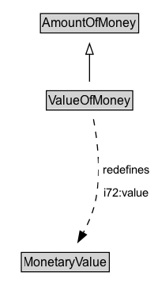

# ValueOfMoney

An amount of money that is defined relative to a particular year.

## Diagram

=== "SVG (interactive)"

    <!-- Generated by graphviz version 14.1.3 (20260303.0454)
     -->
    <!-- Pages: 1 -->
    <svg width="150pt" height="286pt"
     viewBox="0.00 0.00 150.00 286.00" xmlns="http://www.w3.org/2000/svg" xmlns:xlink="http://www.w3.org/1999/xlink">
    <g id="graph0" class="graph" transform="scale(1 1) rotate(0) translate(4 282)">
    <polygon fill="white" stroke="none" points="-4,4 -4,-282 145.78,-282 145.78,4 -4,4"/>
    <g id="clust3" class="cluster">
    <title>cluster_associated</title>
    </g>
    <!-- AmountOfMoney -->
    <g id="node1" class="node">
    <title>AmountOfMoney</title>
    <g id="a_node1"><a xlink:href="../AmountOfMoney" xlink:title="&lt;TABLE&gt;">
    <polygon fill="lightgray" stroke="none" points="35.38,-251.88 35.38,-268.12 126.62,-268.12 126.62,-251.88 35.38,-251.88"/>
    <text xml:space="preserve" text-anchor="start" x="36.38" y="-255.88" font-family="Arial" font-size="12.00">AmountOfMoney</text>
    <polygon fill="none" stroke="black" points="34.38,-250.88 34.38,-269.12 127.62,-269.12 127.62,-250.88 34.38,-250.88"/>
    </a>
    </g>
    </g>
    <!-- ValueOfMoney -->
    <g id="node2" class="node">
    <title>ValueOfMoney</title>
    <g id="a_node2"><a xlink:href="../ValueOfMoney" xlink:title="&lt;TABLE&gt;">
    <polygon fill="lightgray" stroke="none" points="41,-178.88 41,-195.12 121,-195.12 121,-178.88 41,-178.88"/>
    <text xml:space="preserve" text-anchor="start" x="42" y="-182.88" font-family="Arial" font-size="12.00">ValueOfMoney</text>
    <polygon fill="none" stroke="black" points="40,-177.88 40,-196.12 122,-196.12 122,-177.88 40,-177.88"/>
    </a>
    </g>
    </g>
    <!-- ValueOfMoney&#45;&gt;AmountOfMoney -->
    <g id="edge1" class="edge">
    <title>ValueOfMoney&#45;&gt;AmountOfMoney</title>
    <path fill="none" stroke="black" d="M81,-204.71C81,-212.47 81,-221.92 81,-230.74"/>
    <polygon fill="none" stroke="black" points="77.5,-230.66 81,-240.66 84.5,-230.66 77.5,-230.66"/>
    </g>
    <!-- Invis -->
    <!-- ValueOfMoney&#45;&gt;Invis -->
    <!-- MonetaryValue -->
    <g id="node4" class="node">
    <title>MonetaryValue</title>
    <g id="a_node4"><a xlink:href="../MonetaryValue" xlink:title="&lt;TABLE&gt;">
    <polygon fill="lightgray" stroke="none" points="17.25,-25.88 17.25,-42.12 98.75,-42.12 98.75,-25.88 17.25,-25.88"/>
    <text xml:space="preserve" text-anchor="start" x="18.25" y="-29.88" font-family="Arial" font-size="12.00">MonetaryValue</text>
    <polygon fill="none" stroke="black" points="16.25,-24.88 16.25,-43.12 99.75,-43.12 99.75,-24.88 16.25,-24.88"/>
    </a>
    </g>
    </g>
    <!-- ValueOfMoney&#45;&gt;MonetaryValue -->
    <g id="edge4" class="edge">
    <title>ValueOfMoney&#45;&gt;MonetaryValue</title>
    <path fill="none" stroke="black" stroke-dasharray="5,2" d="M84.75,-169.25C88.46,-149.7 92.71,-116.52 86,-89 83.71,-79.62 79.49,-70.06 75,-61.63"/>
    <polygon fill="black" stroke="black" points="78.06,-59.93 70.06,-52.99 71.99,-63.41 78.06,-59.93"/>
    <polygon fill="white" stroke="none" points="89.53,-89 89.53,-132 141.78,-132 141.78,-89 89.53,-89"/>
    <text xml:space="preserve" text-anchor="start" x="93.53" y="-117.5" font-family="Arial" font-size="11.00">redefines</text>
    <text xml:space="preserve" text-anchor="start" x="94.28" y="-96" font-family="Arial" font-size="11.00">i72:value</text>
    </g>
    <!-- Invis&#45;&gt;MonetaryValue -->
    </g>
    </svg>

=== "PNG"

    

## Formalization for ValueOfMoney

| Property | Constraint |
|----------|------------|
| [i72:value](https://w3id.org/citydata/21972/v1/value) | only [MonetaryValue](https://w3id.org/citydata/part1/v1/MonetaryValue) |
| subClassOf | [AmountOfMoney](AmountOfMoney.md) |

