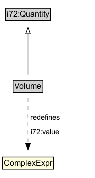

# Volume

Volume is a measure of how much three-dimensional space any phenomenon occupies. 

## Diagram

=== "SVG (interactive)"

    <!-- Generated by graphviz version 14.1.3 (20260303.0454)
     -->
    <!-- Pages: 1 -->
    <svg width="142pt" height="267pt"
     viewBox="0.00 0.00 142.00 267.00" xmlns="http://www.w3.org/2000/svg" xmlns:xlink="http://www.w3.org/1999/xlink">
    <g id="graph0" class="graph" transform="scale(1 1) rotate(0) translate(4 263)">
    <polygon fill="white" stroke="none" points="-4,4 -4,-263 138.38,-263 138.38,4 -4,4"/>
    <g id="clust3" class="cluster">
    <title>cluster_associated</title>
    </g>
    <!-- i72_Quantity -->
    <g id="node1" class="node">
    <title>i72_Quantity</title>
    <g id="a_node1"><a xlink:href="https://w3id.org/citydata/21972/v1/Quantity" xlink:title="&lt;TABLE&gt;">
    <polygon fill="lightgray" stroke="none" points="5.5,-232.88 5.5,-249.12 71.25,-249.12 71.25,-232.88 5.5,-232.88"/>
    <text xml:space="preserve" text-anchor="start" x="6.5" y="-236.88" font-family="Arial" font-size="12.00">i72:Quantity</text>
    <polygon fill="none" stroke="black" points="4.5,-231.88 4.5,-250.12 72.25,-250.12 72.25,-231.88 4.5,-231.88"/>
    </a>
    </g>
    </g>
    <!-- Volume -->
    <g id="node2" class="node">
    <title>Volume</title>
    <g id="a_node2"><a xlink:href="../Volume" xlink:title="&lt;TABLE&gt;">
    <polygon fill="lightgray" stroke="none" points="17.12,-124.88 17.12,-141.12 59.62,-141.12 59.62,-124.88 17.12,-124.88"/>
    <text xml:space="preserve" text-anchor="start" x="18.12" y="-128.88" font-family="Arial" font-size="12.00">Volume</text>
    <polygon fill="none" stroke="black" points="16.12,-123.88 16.12,-142.12 60.62,-142.12 60.62,-123.88 16.12,-123.88"/>
    </a>
    </g>
    </g>
    <!-- Volume&#45;&gt;i72_Quantity -->
    <g id="edge1" class="edge">
    <title>Volume&#45;&gt;i72_Quantity</title>
    <path fill="none" stroke="black" d="M38.38,-150.8C38.38,-167.28 38.38,-192.7 38.38,-212.2"/>
    <polygon fill="none" stroke="black" points="34.88,-211.92 38.38,-221.92 41.88,-211.92 34.88,-211.92"/>
    </g>
    <!-- na010c749982e452794368b522251db07b29 -->
    <g id="node4" class="node">
    <title>na010c749982e452794368b522251db07b29</title>
    <polygon fill="lightyellow" stroke="none" points="0,-8.88 0,-27.12 76.75,-27.12 76.75,-8.88 0,-8.88"/>
    <text xml:space="preserve" text-anchor="start" x="2" y="-13.88" font-family="Arial" font-size="12.00">ComplexExpr</text>
    <polygon fill="none" stroke="black" points="0,-8.88 0,-27.12 76.75,-27.12 76.75,-8.88 0,-8.88"/>
    </g>
    <!-- Volume&#45;&gt;na010c749982e452794368b522251db07b29 -->
    <g id="edge2" class="edge">
    <title>Volume&#45;&gt;na010c749982e452794368b522251db07b29</title>
    <path fill="none" stroke="black" stroke-dasharray="5,2" d="M38.38,-115.33C38.38,-97.38 38.38,-68.54 38.38,-47.08"/>
    <polygon fill="black" stroke="black" points="41.88,-47.26 38.38,-37.26 34.88,-47.26 41.88,-47.26"/>
    <polygon fill="white" stroke="none" points="38.38,-54 38.38,-97 90.62,-97 90.62,-54 38.38,-54"/>
    <text xml:space="preserve" text-anchor="start" x="42.38" y="-82.5" font-family="Arial" font-size="11.00">redefines</text>
    <text xml:space="preserve" text-anchor="start" x="43.12" y="-61" font-family="Arial" font-size="11.00">i72:value</text>
    </g>
    <!-- Invis -->
    </g>
    </svg>

=== "PNG"

    

## Formalization for Volume

| Property | Constraint |
|----------|------------|
| subClassOf | [i72:Quantity](i72:Quantity.md) |

