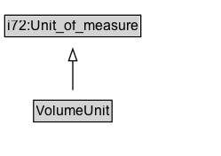

# VolumeUnit

A specified system of units for volume.

## Diagram

=== "SVG (interactive)"

    <!-- Generated by graphviz version 14.1.3 (20260303.0454)
     -->
    <!-- Pages: 1 -->
    <svg width="187pt" height="132pt"
     viewBox="0.00 0.00 187.00 132.00" xmlns="http://www.w3.org/2000/svg" xmlns:xlink="http://www.w3.org/1999/xlink">
    <g id="graph0" class="graph" transform="scale(1 1) rotate(0) translate(4 128)">
    <polygon fill="white" stroke="none" points="-4,4 -4,-128 182.5,-128 182.5,4 -4,4"/>
    <g id="clust3" class="cluster">
    <title>cluster_associated</title>
    </g>
    <!-- i72_Unit_of_measure -->
    <g id="node1" class="node">
    <title>i72_Unit_of_measure</title>
    <g id="a_node1"><a xlink:href="https://w3id.org/citydata/21972/v1/Unit_of_measure" xlink:title="&lt;TABLE&gt;">
    <polygon fill="lightgray" stroke="none" points="1,-97.88 1,-114.12 114,-114.12 114,-97.88 1,-97.88"/>
    <text xml:space="preserve" text-anchor="start" x="2" y="-101.88" font-family="Arial" font-size="12.00">i72:Unit_of_measure</text>
    <polygon fill="none" stroke="black" points="0,-96.88 0,-115.12 115,-115.12 115,-96.88 0,-96.88"/>
    </a>
    </g>
    </g>
    <!-- VolumeUnit -->
    <g id="node2" class="node">
    <title>VolumeUnit</title>
    <g id="a_node2"><a xlink:href="../VolumeUnit" xlink:title="&lt;TABLE&gt;">
    <polygon fill="lightgray" stroke="none" points="25.38,-25.88 25.38,-42.12 89.62,-42.12 89.62,-25.88 25.38,-25.88"/>
    <text xml:space="preserve" text-anchor="start" x="26.38" y="-29.88" font-family="Arial" font-size="12.00">VolumeUnit</text>
    <polygon fill="none" stroke="black" points="24.38,-24.88 24.38,-43.12 90.62,-43.12 90.62,-24.88 24.38,-24.88"/>
    </a>
    </g>
    </g>
    <!-- VolumeUnit&#45;&gt;i72_Unit_of_measure -->
    <g id="edge1" class="edge">
    <title>VolumeUnit&#45;&gt;i72_Unit_of_measure</title>
    <path fill="none" stroke="black" d="M57.5,-51.79C57.5,-59.25 57.5,-68.24 57.5,-76.69"/>
    <polygon fill="none" stroke="black" points="54,-76.54 57.5,-86.54 61,-76.54 54,-76.54"/>
    </g>
    <!-- Invis -->
    </g>
    </svg>

=== "PNG"

    

## Formalization for VolumeUnit

| Property | Constraint |
|----------|------------|
| subClassOf | [i72:Unit_of_measure](https://w3id.org/citydata/21972/v1/Unit_of_measure) |

