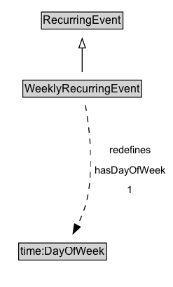

# WeeklyRecurringEvent

A WeeklyRecurringEvent recurs on the regularly on the same day of the week, as specified by the schema:dayOfWeek property.

## Diagram

=== "SVG (interactive)"

    <!-- Generated by graphviz version 14.1.3 (20260303.0454)
     -->
    <!-- Pages: 1 -->
    <svg width="185pt" height="308pt"
     viewBox="0.00 0.00 185.00 308.00" xmlns="http://www.w3.org/2000/svg" xmlns:xlink="http://www.w3.org/1999/xlink">
    <g id="graph0" class="graph" transform="scale(1 1) rotate(0) translate(4 303.5)">
    <polygon fill="white" stroke="none" points="-4,4 -4,-303.5 180.92,-303.5 180.92,4 -4,4"/>
    <g id="clust3" class="cluster">
    <title>cluster_associated</title>
    </g>
    <!-- RecurringEvent -->
    <g id="node1" class="node">
    <title>RecurringEvent</title>
    <g id="a_node1"><a xlink:href="../RecurringEvent" xlink:title="&lt;TABLE&gt;">
    <polygon fill="lightgray" stroke="none" points="41.38,-273.38 41.38,-289.62 126.62,-289.62 126.62,-273.38 41.38,-273.38"/>
    <text xml:space="preserve" text-anchor="start" x="42.38" y="-277.38" font-family="Arial" font-size="12.00">RecurringEvent</text>
    <polygon fill="none" stroke="black" points="40.38,-272.38 40.38,-290.62 127.62,-290.62 127.62,-272.38 40.38,-272.38"/>
    </a>
    </g>
    </g>
    <!-- WeeklyRecurringEvent -->
    <g id="node2" class="node">
    <title>WeeklyRecurringEvent</title>
    <g id="a_node2"><a xlink:href="../WeeklyRecurringEvent" xlink:title="&lt;TABLE&gt;">
    <polygon fill="lightgray" stroke="none" points="21.5,-200.38 21.5,-216.62 146.5,-216.62 146.5,-200.38 21.5,-200.38"/>
    <text xml:space="preserve" text-anchor="start" x="22.5" y="-204.38" font-family="Arial" font-size="12.00">WeeklyRecurringEvent</text>
    <polygon fill="none" stroke="black" points="20.5,-199.38 20.5,-217.62 147.5,-217.62 147.5,-199.38 20.5,-199.38"/>
    </a>
    </g>
    </g>
    <!-- WeeklyRecurringEvent&#45;&gt;RecurringEvent -->
    <g id="edge1" class="edge">
    <title>WeeklyRecurringEvent&#45;&gt;RecurringEvent</title>
    <path fill="none" stroke="black" d="M84,-226.21C84,-233.97 84,-243.42 84,-252.24"/>
    <polygon fill="none" stroke="black" points="80.5,-252.16 84,-262.16 87.5,-252.16 80.5,-252.16"/>
    </g>
    <!-- Invis -->
    <!-- WeeklyRecurringEvent&#45;&gt;Invis -->
    <!-- time_DayOfWeek -->
    <g id="node4" class="node">
    <title>time_DayOfWeek</title>
    <g id="a_node4"><a xlink:href="https://w3id.org/citydata/imported/time/latest/DayOfWeek" xlink:title="&lt;TABLE&gt;">
    <polygon fill="lightgray" stroke="none" points="17,-25.88 17,-42.12 109,-42.12 109,-25.88 17,-25.88"/>
    <text xml:space="preserve" text-anchor="start" x="18" y="-29.88" font-family="Arial" font-size="12.00">time:DayOfWeek</text>
    <polygon fill="none" stroke="black" points="16,-24.88 16,-43.12 110,-43.12 110,-24.88 16,-24.88"/>
    </a>
    </g>
    </g>
    <!-- WeeklyRecurringEvent&#45;&gt;time_DayOfWeek -->
    <g id="edge4" class="edge">
    <title>WeeklyRecurringEvent&#45;&gt;time_DayOfWeek</title>
    <path fill="none" stroke="black" stroke-dasharray="5,2" d="M87.45,-190.76C91.61,-167.58 97.11,-124.53 89,-89 86.88,-79.73 82.96,-70.19 78.8,-61.76"/>
    <polygon fill="black" stroke="black" points="81.99,-60.32 74.22,-53.12 75.81,-63.6 81.99,-60.32"/>
    <polygon fill="white" stroke="none" points="93.17,-89 93.17,-153.5 176.92,-153.5 176.92,-89 93.17,-89"/>
    <text xml:space="preserve" text-anchor="start" x="112.92" y="-139" font-family="Arial" font-size="11.00">redefines</text>
    <text xml:space="preserve" text-anchor="start" x="97.17" y="-117.5" font-family="Arial" font-size="11.00">hasDayOfWeek</text>
    <text xml:space="preserve" text-anchor="start" x="132.05" y="-96" font-family="Arial" font-size="11.00">1</text>
    </g>
    <!-- Invis&#45;&gt;time_DayOfWeek -->
    </g>
    </svg>

=== "PNG"

    

## Formalization for WeeklyRecurringEvent

| Property | Constraint |
|----------|------------|
| [hasDayOfWeek](../properties/hasDayOfWeek.md) | exactly 1 |
| [hasDayOfWeek](../properties/hasDayOfWeek.md) | exactly 1 [time:DayOfWeek](http://www.w3.org/2006/time#DayOfWeek) |
| subClassOf | [RecurringEvent](RecurringEvent.md) |

