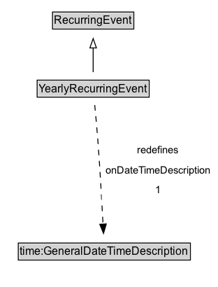

# YearlyRecurringEvent

A YearlyRecurringEvent recurs regularly on the same day of the same month, as specified by the hasMonth and dayOfMonth properties. As with MonthlyRecurringEvent, there may be ambiguity regarding the semantics of a yearly recurring event, however this formalization captures only the notion of an event that recurs on the same day of the same month (e.g. a birthday).

## Diagram

=== "SVG (interactive)"

    <!-- Generated by graphviz version 14.1.3 (20260303.0454)
     -->
    <!-- Pages: 1 -->
    <svg width="234pt" height="308pt"
     viewBox="0.00 0.00 234.00 308.00" xmlns="http://www.w3.org/2000/svg" xmlns:xlink="http://www.w3.org/1999/xlink">
    <g id="graph0" class="graph" transform="scale(1 1) rotate(0) translate(4 303.5)">
    <polygon fill="white" stroke="none" points="-4,4 -4,-303.5 229.69,-303.5 229.69,4 -4,4"/>
    <g id="clust3" class="cluster">
    <title>cluster_associated</title>
    </g>
    <!-- RecurringEvent -->
    <g id="node1" class="node">
    <title>RecurringEvent</title>
    <g id="a_node1"><a xlink:href="../RecurringEvent" xlink:title="&lt;TABLE&gt;">
    <polygon fill="lightgray" stroke="none" points="53.38,-273.38 53.38,-289.62 138.62,-289.62 138.62,-273.38 53.38,-273.38"/>
    <text xml:space="preserve" text-anchor="start" x="54.38" y="-277.38" font-family="Arial" font-size="12.00">RecurringEvent</text>
    <polygon fill="none" stroke="black" points="52.38,-272.38 52.38,-290.62 139.62,-290.62 139.62,-272.38 52.38,-272.38"/>
    </a>
    </g>
    </g>
    <!-- YearlyRecurringEvent -->
    <g id="node2" class="node">
    <title>YearlyRecurringEvent</title>
    <g id="a_node2"><a xlink:href="../YearlyRecurringEvent" xlink:title="&lt;TABLE&gt;">
    <polygon fill="lightgray" stroke="none" points="36.88,-200.38 36.88,-216.62 155.12,-216.62 155.12,-200.38 36.88,-200.38"/>
    <text xml:space="preserve" text-anchor="start" x="37.88" y="-204.38" font-family="Arial" font-size="12.00">YearlyRecurringEvent</text>
    <polygon fill="none" stroke="black" points="35.88,-199.38 35.88,-217.62 156.12,-217.62 156.12,-199.38 35.88,-199.38"/>
    </a>
    </g>
    </g>
    <!-- YearlyRecurringEvent&#45;&gt;RecurringEvent -->
    <g id="edge1" class="edge">
    <title>YearlyRecurringEvent&#45;&gt;RecurringEvent</title>
    <path fill="none" stroke="black" d="M96,-226.21C96,-233.97 96,-243.42 96,-252.24"/>
    <polygon fill="none" stroke="black" points="92.5,-252.16 96,-262.16 99.5,-252.16 92.5,-252.16"/>
    </g>
    <!-- Invis -->
    <!-- YearlyRecurringEvent&#45;&gt;Invis -->
    <!-- time_GeneralDateTimeDescription -->
    <g id="node4" class="node">
    <title>time_GeneralDateTimeDescription</title>
    <g id="a_node4"><a xlink:href="https://w3id.org/citydata/imported/time/latest/GeneralDateTimeDescription" xlink:title="&lt;TABLE&gt;">
    <polygon fill="lightgray" stroke="none" points="16.62,-25.88 16.62,-42.12 199.38,-42.12 199.38,-25.88 16.62,-25.88"/>
    <text xml:space="preserve" text-anchor="start" x="17.62" y="-29.88" font-family="Arial" font-size="12.00">time:GeneralDateTimeDescription</text>
    <polygon fill="none" stroke="black" points="15.62,-24.88 15.62,-43.12 200.38,-43.12 200.38,-24.88 15.62,-24.88"/>
    </a>
    </g>
    </g>
    <!-- YearlyRecurringEvent&#45;&gt;time_GeneralDateTimeDescription -->
    <g id="edge4" class="edge">
    <title>YearlyRecurringEvent&#45;&gt;time_GeneralDateTimeDescription</title>
    <path fill="none" stroke="black" stroke-dasharray="5,2" d="M97.67,-190.97C98.72,-180.29 100.05,-166.08 101,-153.5 103.33,-122.7 105.34,-87.35 106.59,-63.33"/>
    <polygon fill="black" stroke="black" points="110.08,-63.57 107.1,-53.4 103.09,-63.21 110.08,-63.57"/>
    <polygon fill="white" stroke="none" points="105.19,-89 105.19,-153.5 225.69,-153.5 225.69,-89 105.19,-89"/>
    <text xml:space="preserve" text-anchor="start" x="143.31" y="-139" font-family="Arial" font-size="11.00">redefines</text>
    <text xml:space="preserve" text-anchor="start" x="109.19" y="-117.5" font-family="Arial" font-size="11.00">onDateTimeDescription</text>
    <text xml:space="preserve" text-anchor="start" x="162.44" y="-96" font-family="Arial" font-size="11.00">1</text>
    </g>
    <!-- Invis&#45;&gt;time_GeneralDateTimeDescription -->
    </g>
    </svg>

=== "PNG"

    

## Formalization for YearlyRecurringEvent

| Property | Constraint |
|----------|------------|
| [onDateTimeDescription](../properties/onDateTimeDescription.md) | exactly 1 |
| [onDateTimeDescription](../properties/onDateTimeDescription.md) | exactly 1 [time:GeneralDateTimeDescription](http://www.w3.org/2006/time#GeneralDateTimeDescription) |
| subClassOf | [RecurringEvent](RecurringEvent.md) |

